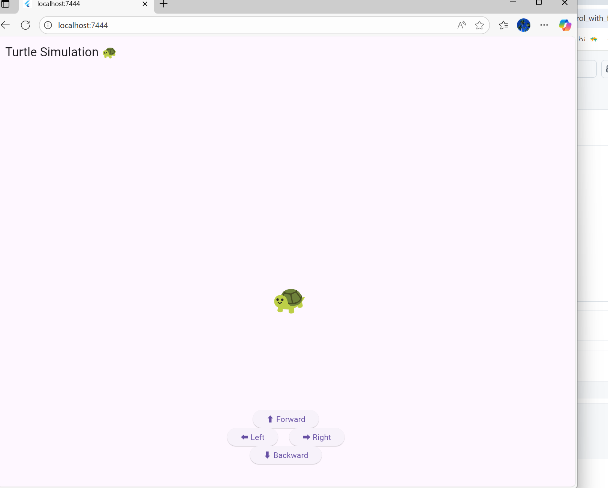
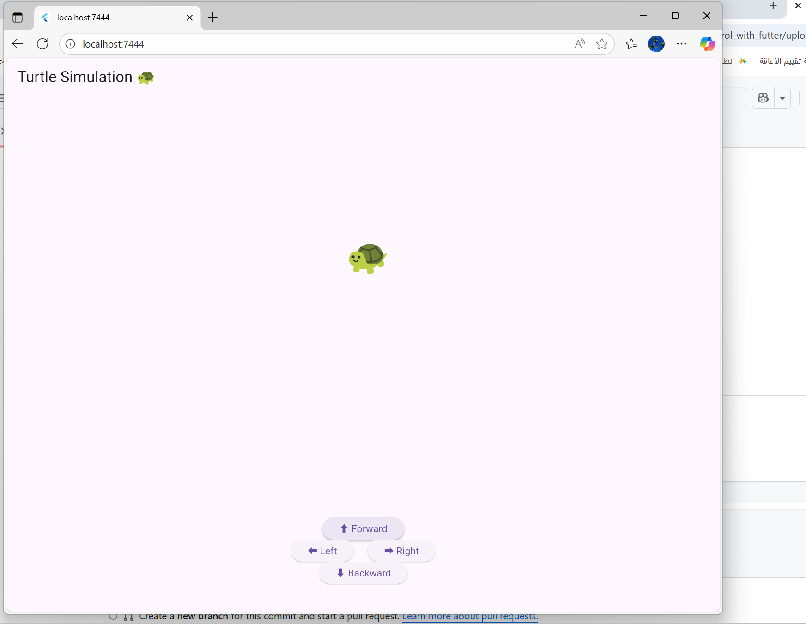
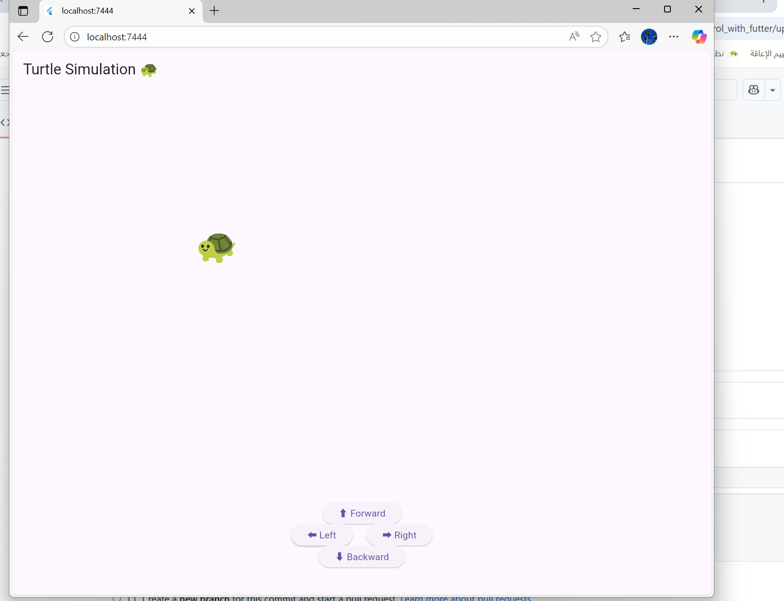

# 🐢 Turtle Controller – Control with Flutter

A simple *Flutter-based* application to control a turtle robot.  
This project is *fully ready to connect with ROSBridge (ROS)* through WebSocket communication.

---

## 📸 Interface Preview

*Main Layout*


*Forward Button*


*Right Button*


---

## 🚀 Overview# control_with_futter1
This project demonstrates how Flutter can be used to control a robot.  
It’s ready to connect with *ROSBridge* through WebSocket.

---

## 📂 Files

---

## 🧠 Features
- Simple control interface using Flutter  
- Direction buttons for robot movement  
- ✅ Fully ready for ROSBridge connection  
- Works even without ROS as a UI demo  

---

## 🛠 Setup
1. Install Flutter  
2. Clone the project:
   ```bash
   git clone https://github.com/your-username/control_with_flutter.git
   cd control_with_flutter
